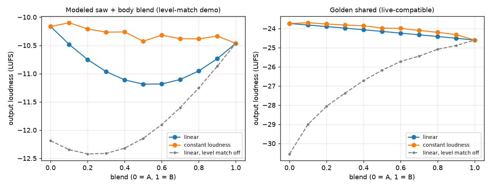

# Phase 10.1 report: path level matching and the constant-loudness blend

Spec: `docs/specs/phase10_1_path_level_match.md` (with the lead's binding implementation decisions at
its end). Status: **accepted by the lead after reviewer ACCEPT (round 1, no must-fix items).**. Branch `claude/sawblade-p10-1-level-match`; no PR was opened.

Commits: `831db45` (spec decisions), `5cce5fa` (plot script + demo blend preset), `ad6bcf2` / `ad12ebe`
(matcher, merged in `8ed9ba3`), `5c6407e` (core), `ea5baa4` (CLI + bindings), `87652b9` (plugin),
`50d0f14` (tests), `0828ff8` (schema docs), `c25ad9a` (plot), `0bf33fb` (legacy bit-identity fix).
`2b7124f` (this report, draft), `967395d` (real-binding `level_match` pytest, a reviewer suggestion), plus the final report commit. Total diff since the spec: 35 files, +1,646 / −59.

## What the user gets

- **Level-matched paths.** On preset load, capture swap and the rig editor's MATCH LEVELS, the engine runs
  a second deterministic probe segment (1.5 s of synthesized palm-muted Karplus–Strong plucks at
  A1/D2/E2, 8 hits, peak −12 dBFS, seed 2, generated in code) through both paths at the blend point and
  measures each path's BS.1770 loudness. The quieter path gets a positive trim (louder path 0, clamp
  +18 dB), folded into the path's existing level gain: no new stage, no latency. The player's LEVEL
  knob stays on top as a taste offset and never changes the trim.
- **A blend knob that does not change the loudness.** `blendLaw: constantLoudness` is an equal-power
  crossfade followed by a make-up gain measured on the probe at five blend positions (linear in dB in
  between), so the output loudness is the same at every knob position. `linear` (the old behaviour) is
  still available and is the default for every existing preset.
- **6 dB of sum headroom** (0.5 at the sum node, ×2 at the output gain, both exact in float). The bus
  compressor's threshold is referred to the pre-headroom level, so existing compressor settings behave as
  before.
- **Rig editor:** MATCH LEVELS on the blend strip, a `+2.0 dB auto · +1.0 dB` read-out under each LEVEL
  knob (auto trim and user offset shown separately), a LINEAR / CONSTANT toggle next to BLEND. A preset
  that becomes a blend in the editor gets `auto` + `constantLoudness`. Everything round-trips through
  plugin state.
- **Matcher:** candidates are level-matched (through `sawblade_core.level_match`) before the blend is
  fitted; the fitted linear blend is converted to the constant-loudness position with the same A:B
  ratio, and emitted presets carry `levelMatch` (manual, measured trims) + `blendLaw: constantLoudness`.
  The Occam single-vs-blend comparison now runs between level-matched candidates; the loss is unchanged.
- **CLI:** `tonerender --report` writes `levelMatch` and `blend.makeupDb` and prints one summary line.

## Measurements

The two presets the spec names, `presets/matched/barbaric_v4.json` and the `presets/styles/*.json`
presets, are **single-path presets** (path b disabled, `blend: 0`), so for them the probe is skipped by
construction and the report reads `trimADb = trimBDb = 0`, `makeupDb = [0 × 5]`, `measured: false`.
Their TONE3000 captures are not on this machine (no OAuth token in the container; captures are never
committed), so they could not be rendered here at all. On the main machine:

```
./build/cli/tonerender --preset presets/matched/barbaric_v4.json --in <di.wav> --out /dev/null --report r.json
```

prints the (zero) trims. The mechanism was therefore measured on two blends that render from the repo
alone, both through `tests/fixtures/di_riff.wav` (4 s, 48 kHz) with `levelMatch: auto`:

| Preset | lufsA / lufsB (probe, at the blend point) | trimA / trimB | sumLufs (b = 0.5) | makeupDb at b = 0, .25, .5, .75, 1 |
|---|---|---|---|---|
| `presets/modeled/saw_body_blend_demo.json` (new: Blend Partner chainsaw saw vs modeled boost → HM body) | −12.26 / −10.23 | **+2.02 / 0.00** | −10.99 | 0.00, −1.70, −2.25, −1.70, 0.00 |
| `tests/fixtures/presets/golden_shared.json` (fixture NAM models, shared cab) | −33.07 / −18.61 | **+14.46 / 0.00** | −19.05 | 0.00, −1.96, −2.57, −1.96, 0.00 |

Output loudness of the rendered riff vs blend, both laws (`docs/specs/plots/phase10_1_loudness_vs_blend.png`,
data in the `.json` next to it; made by `scripts/plot_level_match.py`):



| Preset | law | spread across b = 0 … 1 (LU) |
|---|---|---|
| demo blend | linear, level match off (pre-10.1 behaviour) | 1.96 |
| demo blend | linear, trimmed | 1.02 (dips in the middle: the two modeled paths are partly out of phase) |
| demo blend | **constantLoudness** | **0.36** |
| golden_shared | linear, level match off | 5.95 |
| golden_shared | linear, trimmed | 0.86 |
| golden_shared | **constantLoudness** | **0.91** |

Reading: the trims remove the gross level difference (2 and 14 dB) and the constant-loudness make-up
removes the mid-blend dip (demo: 1.0 LU → 0.4 LU). On `golden_shared` both laws drift about 0.9 LU from
one end of the knob to the other because the two paths, matched on the probe, still differ by that much
on the riff (the probe is a palm-mute burst; the riff has more open-string content). That is the
expected program dependence of a fixed probe, and the spec test (±0.3 LU on the probe itself) passes.

## How it is built

- **Core** (`core/src/chain.cpp`): `Chain::resolveLevelMatch()` runs inside `prepare()` right after
  alignment, whenever both paths are enabled and (`levelMatch.mode != off` or
  `blendLaw == constantLoudness`). The probe output of both paths (aligned, polarity-corrected, with the
  preset's `levelDb`) is kept in memory; trims, `sumLufs` and the five make-up points are measured on
  in-memory sums, no re-render. `Lref = (L(0) + L(1)) / 2`, make-up clamped ±12 dB. Trims are folded into
  the path level gain target. `LiveParams.blendLaw` is a live control; the effective A/B weights
  (0.5 · law weight · make-up, polarity on B) ramp over `kLiveRampMs` like the old blend, so `process()`
  does no `exp`, no interpolation, no allocation. `ChainInfo` carries `levelMatchMode`, `trimDb[2]`,
  `lufs[2]`, `sumLufs`, `makeupDb[5]`, `blendLaw`, `levelMeasured`.
- **Legacy bit-identity.** A legacy-shaped preset (`off` + `linear`) never runs the new probe. This
  matters because NAM's LSTM prewarm starts from the used hidden state: a probe that runs where none ran
  before shifts the first samples by about 1e-7. With the rule, `golden_perpath` (LSTM, manual align)
  renders the committed golden with max abs diff exactly 0, and the goldens in git are untouched.
- **Schema** (`docs/PRESET_SCHEMA.md`, Blend section rewritten): `levelMatch { mode, trimADb, trimBDb }`,
  `blendLaw`; absent keys == `off` + `linear`; the writer emits both keys. Render report:
  `levelMatch { mode, measured, trimADb, trimBDb, lufsA, lufsB, sumLufs }`,
  `blend { value, law, makeupDb[5] }`.
- **Plugin:** MATCH LEVELS reuses the RE-MEASURE path (probe on the loader thread, result handed back
  lock-free) and writes `levelMatch.mode = manual` with the measured trims, like RE-MEASURE does for
  `align`. The law toggle is a live edit when the running engine has a measured curve; CONSTANT on an
  engine without one (a legacy preset) is a structural edit through the loader, which rebuilds and
  probes. A preset loaded in `auto` stays `auto`; the read-outs show the resolved trims.
- **Bindings / matcher:** `sawblade_core.level_match(preset, sample_rate, base_dir=None, cache=None)`
  builds the chain, prepares, returns the info dict (forces `levelMatch.mode = auto` so a legacy preset
  still measures; adds `warnings`). `match/sawblade_match/matcher/levelmatch.py` holds the wrapper, the
  `b_lin → b_cl = (2/π)·atan(b_lin/(1−b_lin))` conversion, make-up interpolation and the output-gain
  correction; `engine.py`, `screen.py`, `refine.py`, `space.py`, `run.py` thread the trims through the
  rescore, the refinement and the emitted preset; `export/plan.py`, `export/run.py` print the trims and
  make-up from the render report.

## Deviations from the spec (lead-accepted)

1. Probe gating by preset shape (above) instead of "always when both paths are enabled": the price is
   that a legacy preset toggled to CONSTANT in the editor needs one rebuild; the gain is exact legacy
   output.
2. The pybind `level_match` forces `levelMatch.mode = auto` (a legacy preset would otherwise return
   zeros, which is useless to the matcher).
3. The rig editor cannot tell "keys absent" from "explicit off + linear" on a parsed `Preset`, so an
   explicit `off` + `linear` preset is also switched to `auto` + `constantLoudness` the first time it
   becomes a blend.
4. The A/B weights are ramped as combined effective weights rather than three separate ramps (same
   result, fewer ramps).
5. `getProgramName` now returns "Default": the freshly built pluginval (current master) rejects a
   program with no name. One line, outside the spec.
6. Matcher: an output-gain correction compensates the emitted constant-loudness preset's level against
   the linear emulation the matcher scored (otherwise the emitted tone would be several dB off); trims
   are measured once per candidate with default NAM input gains and `levelA/B` at 0 (the refinement
   keeps `levelA/B` as the taste offset); the cheap stage-1 pair screen is not level-matched, matching
   starts at the stage-1 rescore where each candidate gets its own probe.

## Tests

- `build-plugin` (gcc, Release, `-Werror`, plugin ON, pluginval registered): **ctest 379/379 passed**,
  including `plugin: pluginval VST3` (strictness as registered) and the editor tests under xvfb.
  16 new C++ tests: 14 in `tests/test_level_match.cpp` (probe determinism across runs and block sizes
  64/512; 6 dB `levelDb` offset cancelled within 0.1 dB; constant-loudness output within ±0.3 LU at
  b ∈ {0, .25, .5, .75, 1}; live law toggle without rebuild and with zero allocations, latency unchanged;
  absent keys == explicit off + linear bit for bit; modes; single path measures nothing; +18 dB clamp;
  key round trip and validation; report fields; compressor behaviour under headroom within tolerance;
  headroom transparent without a compressor; legacy preset never probes and renders the golden exactly;
  constant law on the legacy preset measures a curve), 1 rig-model test, 1 editor test (MATCH LEVELS
  updates the read-outs and writes manual trims; the toggle round-trips; CONSTANT on a legacy preset
  rebuilds once, on a measured engine not at all).
- `build-clang` (clang, Release, plugin ON): **0 warnings**, ctest 378/378 (pluginval is registered only
  in the gcc tree).
- `match/`: **pytest 320 passed, 14 skipped** against a real `sawblade_core` build (`build-py`); the skips
  are the usual demucs / NAM-training / `SAWBLADE_TEST_TRAIN` ones. 13 new tests in
  `match/tests/test_levelmatch.py`, one against the real binding.
- Goldens: `git diff --stat tests/golden` is empty.

## Review

Reviewer verdict **ACCEPT**, round 1, no must-fix items. The reviewer rebuilt both trees, ran a Debug
ASan+UBSan core build (the level-match, chain, align, golden and preset tests pass with no sanitizer
reports), confirmed the goldens and fixtures are untouched in git, that `golden_perpath` renders with
max diff exactly 0, and called the real `sawblade_core.level_match` on the demo preset (same numbers as
the table above). It checked the audio-thread path (`process`, `setLiveParams`, the weight ramps: all
`noexcept`, no allocation, no locks), the probe recipe against the spec line by line, the headroom and
compressor referral, the schema round trip, the plugin threading and the matcher algebra
(`emit_gain_correction_db = −10·log10(b² + (1−b)²) + makeup(b_cl)`).

Optional notes and what the lead did with them: (1) fill in this report (done); (2) test the real
`level_match` binding (done: one pytest, skipped without the module); (3) the CLI prints the
`level match:` line only with `--report`, which is the spec's item 9 reading, kept as is; (4) a silent
path in `manual` mode drops the stored trims to 0 with a warning, as the spec words it; documented here.

## Process (honest note)

- **Review rounds:** 1 (ACCEPT on the first audit, after one implementer-reported deviation was fixed
  before the audit).
- **Wall-clock:** session start about 23:50 UTC (2026-10-04); spec decisions committed 23:56;
  matcher commits 00:03; core/CLI/plugin/tests/docs series 00:22; matcher merge and plot 00:24;
  legacy bit-identity fix 00:49; reviewer dispatched 00:55; ACCEPT 01:23; real-binding test and final report about 01:35. Elapsed about
  1 h 45 min. Implementer time: about
  40 minutes for the C++ series (86 tool calls) plus about 10 minutes for the fix; matcher about 6
  minutes (39 tool calls). The implementer and the matcher engineer ran in parallel (the matcher in a
  git worktree, merged afterwards).
- **Blockers and slowdowns:** the container again lacked the X11 / ALSA / GL / GTK dev packages JUCE
  needs (installed, then the baseline plugin build ran in the background while the spec decisions were
  written); pluginval had to be cloned and built (it also needed `ladspa-sdk`); the Python module tree
  needed pybind11 fetched (worked, about 10 minutes). The named measurement presets turned out to be
  single-path with absent captures, so the measurement moved to repo-renderable blends (above). No usage
  limit was hit.
- **What went well:** writing the ambiguity-resolving decisions into the spec before dispatch let the
  implementer land core, CLI, bindings, plugin, tests and docs in one pass with every acceptance test
  green; the one real deviation (legacy LSTM bit-identity) was found by the implementer's own baseline
  comparison, not by the tests, and fixed in one round.

## Open items for the main lead

1. Measure `barbaric_v4` and a style preset on the main machine (command above); they are single-path,
   so the interesting measurement is the next blend the matcher produces.
2. The probe is a fixed palm-mute burst; matched paths can still differ by about 1 LU on open-chord
   material (`golden_shared` above). A per-song level match (probe = the user's own DI) would close that
   and is a small extension of `resolveLevelMatch()`.
3. Proposed extras (not built): a pybind test for `level_match` in the C++ tree; a `matchLevels`
   mid-playback test with concurrent edits like the existing re-measure test; drag handles for the
   make-up curve (not recommended: it is measured, not a taste control).
